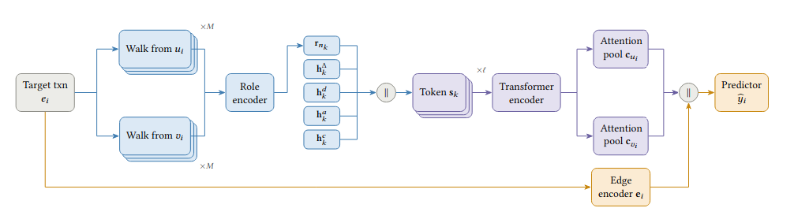

# TraceFormer-AML



This repository contains the **official implementation** of the paper:

> **TraceFormer-AML: Role-Aware Causal Sequence Modeling for Anti-Money Laundering Detection in Temporal Transaction Graphs**

TraceFormer-AML is a **temporal transaction-graph model** for AML detection.  
It combines **temporal role features**, **causal anonymous walk sampling**, **Transformer-based sequence encoding**, and **attention-based aggregation** for suspicious transaction classification.

---

## Overview

Real-world financial systems generate massive streams of transactions that naturally form **dynamic graphs**.  
In anti-money laundering (AML), suspicious behavior is often **rare**, **temporally structured**, and **hard to detect from static snapshots alone**.

TraceFormer-AML is designed for this setting by modeling:

- **historical interaction structure** through temporal role features
- **causal transaction history** through backward temporal walks
- **sequential behavior patterns** through Transformer encoding
- **transaction-level risk** through edge classification

The method is particularly suited for datasets such as:

- **SAML-D**
- **AMLWorld**
- **AMLSim**

---

## Key Idea

Suspicious financial behavior is often better characterized by **how an account behaves over time** than by static graph structure alone.

TraceFormer-AML tackles this by:

- computing **time-dependent structural role features** for each node
- sampling **causal walks** over past transaction history
- encoding those walks as **role-aware temporal sequences**
- aggregating multiple historical traces with **attention**
- predicting whether a transaction is suspicious

This allows the model to capture patterns such as:

- fast pass-through behavior
- bursty transaction chains
- changing sender/receiver roles over time
- repeated or unusual historical interaction traces

---

## Method Summary

TraceFormer-AML consists of four main components:

1. **Temporal Graph Construction**  
   Raw transaction records are converted into a continuous-time event stream:
   \[
   e = (u, v, t, a, y)
   \]
   where \(u\) is sender, \(v\) is receiver, \(t\) is time, \(a\) is amount, and \(y\) is the AML label.

2. **Temporal Role Feature Extraction**  
   For each node at a given time, the model computes rolling structural features such as:
   - in/out degree
   - in/out transaction volume
   - fan-in / fan-out ratio
   - pass-through ratio
   - recency and mean inter-event gaps
   - unique counterparties and repeated interaction rate

3. **Causal Anonymous Walk Sampling**  
   For each target transaction, the model samples **backward temporal walks** over historical neighbors, using only events strictly before the target time.

4. **Transformer-Based Walk Encoding and Attention Aggregation**  
   Each walk is encoded as a temporal sequence of:
   - role features
   - time gaps
   - direction
   - amount bucket
   - anonymous count

   Walks are encoded with a **Transformer**, then aggregated with **attention** to produce sender and receiver context representations for final transaction classification.

---

## Repository Structure

The codebase follows a modular design with **PyTorch Lightning**.

**Top-level files**
- `train.py`  
  Main entry point for training and evaluation.
- `requirements.txt`  
  Python dependencies.

**Directories**
- `data/`  
  Dataset loaders, event construction, and Lightning `DataModule`.
- `graph/`  
  Temporal graph storage, temporal feature extraction, and causal walk sampling.
- `models/`  
  Neural encoders, main model, and Lightning module.
- `utils/`  
  Utility functions for batching, metrics, and reproducibility.

### Main modules

- `data/datasets.py`  
  Dataset-specific preprocessing for:
  - SAML-D
  - AMLWorld
  - AMLSim

- `data/datamodule.py`  
  PyTorch Lightning `DataModule` for train/val/test preparation.

- `graph/temporal_store.py`  
  Stores historical incoming/outgoing edges and supports causal lookup.

- `graph/temporal_features.py`  
  Computes temporal structural role features and precomputes event-level role states.

- `graph/walk_sampler.py`  
  Implements causal anonymous walk sampling.

- `utils/batching.py`  
  Converts raw events into padded model batches.

- `models/encoders.py`  
  Role encoder, step encoder, Transformer walk encoder, and attention aggregator.

- `models/temporal_model.py`  
  Main TraceFormer-AML architecture.

- `models/lightning_module.py`  
  Lightning training/validation/testing logic.

---

## Dataset Processing

The repository supports multiple AML datasets through dataset-specific preprocessing functions.

Currently supported:
- **SAML-D**
- **AMLWorld**
- **AMLSim**

Processing includes:
- parsing transaction records
- reindexing sender and receiver IDs
- converting timestamps into continuous-time event streams
- scaling transaction amounts
- encoding categorical edge attributes
- building edge-level events for temporal modeling

### Notes on categorical features

Different datasets use different transaction metadata.  
The current implementation uses:

- **one-hot encoding** for low-cardinality categories
- **ordinal encoding** for higher-cardinality transaction attributes such as bank identifiers

This keeps edge features compact while remaining flexible across datasets.

### Data location

Place raw dataset files in a suitable location and pass the file path with `--csv`.

Examples:
- `data/samld/SAML-D.csv`
- `data/amlworld/HI-Small_Trans.csv`
- `data/amlsim/transactions.csv`

---

## Implemented Model

The repository currently includes:

- **TraceFormer-AML** (proposed method)

The model combines:
- temporal role-aware feature extraction
- causal historical walks
- Transformer sequence modeling
- attention-based aggregation
- edge-level AML classification

---

## Getting Started

### Prerequisites

- Python **3.10** or higher
- CUDA-enabled GPU recommended
- PyTorch Lightning

---

## Installation

Clone the repository:

```bash
git clone https://github.com/fafal-abnir/traceformer
cd traceformer-aml
```

Create and activate the virtual environment and install dependencies:
```bash
poetry install
poetry shell
pip install torch==2.4.0 torchvision==0.19.0 torchaudio==2.4.0 --index-url https://download.pytorch.org/whl/cu121
pip install pyg_lib torch_scatter torch_sparse torch_cluster torch_spline_conv -f https://data.pyg.org/whl/torch-2.4.0+cu121.html
pip install torch-geometric
pip3 install -r requirements.txt 
```